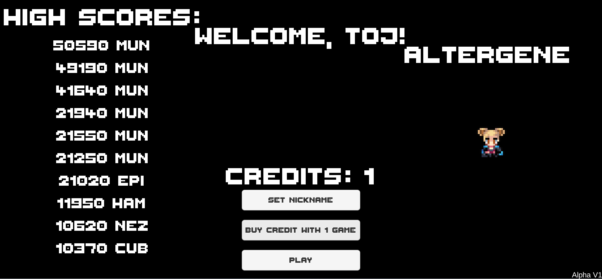

# Altergene

Altergene is our maze-chase arcade game! Pick up coins and avoid the enemies chasing you. Inspired by the original Pacman game, our main character, Luna, has the ability to randomly alter her genes using alchemy for offense, defense, speed, or bonuses! This grants her a powerup when grabbing big coins. Each powerup lasts for about 6 seconds.

Red = Power Mode grants the ability to attack any target that is free from the prison. Can only be used once on each enemy!&#x20;

Blue = Quick Mode grants super speed! This ability can be a blessing and a curse, allowing you to slip by an enemy, or run right into them!&#x20;

Green = Greed Mode grants double the points! Use this to gain an edge over your competitors. Works super well with all the other powerups!&#x20;

Transparent = Ghost Mode grants invulnerability, allowing you to pass through the monster people chasing you!

Controls:\
W/Up/Joystick Up/D-Pad Up: Move Up\
A/Left/Joystick Left/D-Pad Left: Move Left\
S/Down/Joystick Down/D-Pad Down: Move Down\
D/Right/Joystick Right/D-Pad Right: Move Right

All of our blockchain games have a play-to-earn element to them. Altergene has the following challenges and prizes:

**Prizes**

Seasonal:

* High Score: 500 GAME
* Highest Level Score: 250 GAME
* Most Enemies Defeated: 300 GAME
* Highest Level Reached: 250 GAME
* Most Powerups Collected: 250 GAME
* Top Spender: 30% back, 50% back if holding an NFT\

Daily:

* Random User: 50 GAME
* Most Enemies Defeated: 50 GAME

[https://gametheory.tech/#/altergene](https://gametheory.tech/#/altergene)
